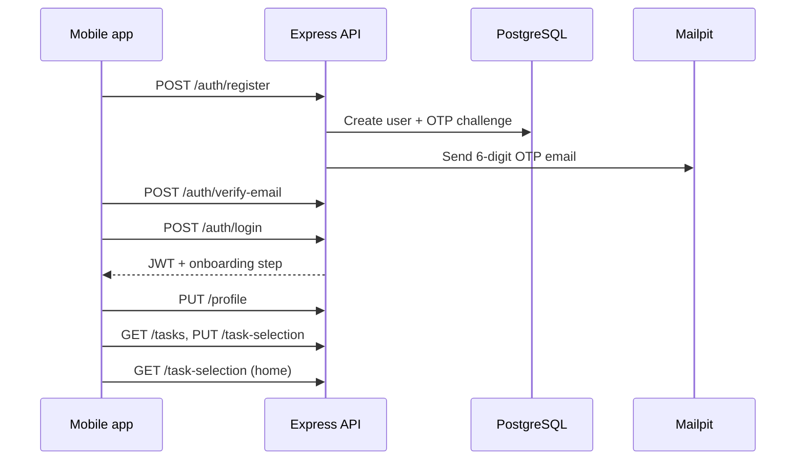

<div align="center">


# PadosiPro

**Household tasks, from signup to your home screen.**

A full-stack take-home: native **Android** app (Expo) plus a self-hosted **Express** API. Users register with email, verify a one-time code, complete a profile, pick tasks from a catalogue, and see their selection at home — all against **local test data** (no production PadosiPro APIs).

[](https://expo.dev)
[](https://reactnative.dev)
[](https://www.typescriptlang.org)
[](https://expressjs.com)
[](https://www.postgresql.org)
[](https://docs.docker.com/compose/)

**Repository:** [github.com/AnkitKumarHub/padosi-pro-assignment](https://github.com/AnkitKumarHub/padosi-pro-assignment)

</div>

---

## Table of contents

- [Reviewer quick start](#reviewer-quick-start)
- [Overview](#overview)
- [What you are evaluating](#what-you-are-evaluating)
- [Key features](#key-features)
- [How it works](#how-it-works)
- [Try the app (APK + local API)](#try-the-app-apk--local-api)
- [Architecture](#architecture)
- [Tech stack](#tech-stack)
- [Getting started](#getting-started)
- [Build the Android APK](#build-the-android-apk)
- [Testing and quality](#testing-and-quality)
- [Project structure](#project-structure)
- [Documentation map](#documentation-map)

---

## Reviewer quick start

**Goal:** run the API on your machine, install the preview APK (or use Expo Go), and walk through register to home in under 15 minutes.

| Step | Action |
| --- | --- |
| 1 | _(Optional)_ Watch the **[walkthrough video](https://drive.google.com/file/d/1DdRpN9acnBiLgTV_FxVdNzJuhOsH_6kM/view?usp=sharing)** |
| 2 | Clone the repo and create **root** `.env` from [`.env.example`](./.env.example) (set `JWT_SECRET` and `OTP_SECRET`, each at least 32 characters, **different** from each other) |
| 3 | `docker compose up --build` from the repository root |
| 4 | Open **Mailpit** at http://localhost:8025 (OTP emails) and **OpenAPI** at http://localhost:3000/api/v1/docs |
| 5 | Install the **[preview APK](https://drive.google.com/file/d/1hjVPTLAa79-mT7oc4EHzJEQnpnmMtfky/view?usp=sharing)** (or dev: `cd mobile && pnpm start`) |
| 6 | On a **physical device**, set **Login -> Server URL** to `http://<your-PC-LAN-IP>:3000/api/v1` (emulator default: `http://10.0.2.2:3000/api/v1`) |
| 7 | Register a **new** email, verify OTP, log in, complete profile, select tasks, confirm, reach **Home** |

Detailed backend and mobile steps: [backend/README.md](./backend/README.md) | [mobile/README.md](./mobile/README.md).

---

## Overview

PadosiPro models the **first customer journey** for a household services product: account creation, email verification, onboarding profile, task catalogue selection, and a persistent home experience. The mobile app is **native React Native** (no WebView). The API is **validated with Zod**, documented with **OpenAPI (Scalar)**, and backed by **PostgreSQL** with migrations and seeded task data on startup.

```text
  Register  -->  Mailpit OTP  -->  Login  -->  Profile  -->  Tasks  -->  Home
```

| | |
| --- | --- |
| **Mobile** | Expo SDK 55, Expo Router, SecureStore JWT, configurable API base URL |
| **API** | Express 5, JWT auth, HMAC-stored email OTP, Drizzle ORM |
| **Local stack** | Docker Compose: Postgres + Mailpit + API |
| **Deliverable** | Source + installable Android **preview APK** (EAS) |

---

## Key features

### Authentication and onboarding

- Email + password registration with **6-digit email OTP** (caught by Mailpit locally)
- Login returns JWT; `GET /auth/me` drives onboarding step routing
- Profile step before task selection; confirmation replaces full task selection

### Task catalogue and home

- Categories and tasks loaded from API seed data
- Client-side search on task name and description
- Home tab shows selected tasks or an empty state with a path to choose tasks
- Browse tab for categories and search entry points

### Platform

| Capability | Detail |
| --- | --- |
| **Secure session** | JWT in `expo-secure-store`; Zustand holds user summary only |
| **Reviewer-friendly API URL** | **Server URL** screen stores base URL per device (LAN IP for APK on phone) |
| **Local HTTP on Android** | Cleartext allowed for dev/preview against Docker API (`expo-build-properties`) |
| **Contract** | OpenAPI generated from Zod schemas shared with runtime validation |

---

## How it works



**Happy path:** Register -> copy OTP from Mailpit -> verify -> login -> profile -> pick tasks -> confirm -> **Home** shows selection -> force-quit and reopen (still logged in) -> logout.

---

## Try the app (APK + local API)

The preview APK talks to **your** machine's API. There is no shared cloud backend in this submission.

### Install the preview APK

| Resource | Link |
| --- | --- |
| **Android APK** | [Download `padosipro.apk` (Google Drive)](https://drive.google.com/file/d/1hjVPTLAa79-mT7oc4EHzJEQnpnmMtfky/view?usp=sharing) |
| **Walkthrough video** | [Watch `Recording padosipro.mp4` (Google Drive)](https://drive.google.com/file/d/1DdRpN9acnBiLgTV_FxVdNzJuhOsH_6kM/view?usp=sharing) |
| **API docs (local)** | http://localhost:3000/api/v1/docs (after `docker compose up`) |
| **OTP inbox (local)** | http://localhost:8025 |

On Android: open the Drive link on your phone or transfer the `.apk` -> allow **Install unknown apps** if prompted -> install -> open **PadosiPro** -> set **Server URL** on a physical device (see [reviewer quick start](#reviewer-quick-start)).

The video shows the full flow on a device against a local API; use the same Mailpit + Docker setup on your machine when you try it yourself.

### Demo accounts

There are **no fixed demo passwords** in the repo. **Register any email** you control (or a throwaway address) and read the OTP from Mailpit on the machine running Docker.

---

## Architecture

```text
+------------------+       HTTP (JSON)        +---------------------------+
|  Expo / RN app   |  --------------------->  |  Express API  :3000       |
|  Expo Router     |      /api/v1             |  Zod + JWT + modules      |
|  SecureStore     |                          +-------------+-------------+
+------------------+                                        |
                                                            v
                                              +-------------+-------------+
                                              |  PostgreSQL  |  Mailpit   |
                                              |  (Docker)    |  SMTP/UI   |
                                              +---------------------------+
```

Mobile runs **outside** Docker so emulators and phones can reach the host API (`10.0.2.2` or LAN IP). See [mobile/README.md](./mobile/README.md#api-base-url).

---

## Tech stack

| Layer | Technology |
| --- | --- |
| **Mobile** | Expo SDK 55, React Native 0.83, React 19, TypeScript, Expo Router |
| **Mobile state** | Zustand (session summary), SecureStore (token + server URL) |
| **API** | Node 22, Express 5, TypeScript, Zod |
| **Data** | PostgreSQL 16, Drizzle ORM, `drizzle-kit` migrations |
| **Auth** | bcrypt passwords, JWT sessions, HMAC OTP (server secret) |
| **Email** | Nodemailer -> Mailpit (local) |
| **Docs** | OpenAPI + Scalar at `/api/v1/docs` |
| **Delivery** | EAS Build (`preview` profile -> `.apk`) |
| **Infra** | Docker Compose |

---

## Getting started

### Prerequisites

- [Docker Desktop](https://www.docker.com/products/docker-desktop/) (Compose v2)
- [Node.js 22 LTS](https://nodejs.org/)
- [pnpm](https://pnpm.io/) 11+
- Android emulator or device; [Expo account](https://expo.dev/signup) for APK builds

### Install and run (short)

```bash
git clone https://github.com/AnkitKumarHub/padosi-pro-assignment.git
cd padosi-pro-assignment
cp .env.example .env
# Edit .env: JWT_SECRET and OTP_SECRET (>= 32 chars, must differ)
docker compose up --build
```

```bash
cd mobile
pnpm install
pnpm start
```

Press **`a`** for Android emulator. Full env and networking notes: [backend/README.md](./backend/README.md) | [mobile/README.md](./mobile/README.md).

---

## Build the Android APK

Submission-style installable APK (no Metro on the reviewer machine):

```bash
cd mobile
npx eas-cli@latest login
npx eas-cli@latest build --platform android --profile preview
```

Install from the Expo build page. Pair with a running local API and **Server URL** on physical devices.

Optional **development client** (with `npx expo start --dev-client`): `--profile development` in `eas.json`.

Windows EAS upload issues (symlinks): see [mobile/README.md](./mobile/README.md#eas-build-android-apk).

---

## Testing and quality

```bash
cd backend && pnpm install && pnpm run typecheck
cd backend && pnpm test
cd mobile && pnpm install && pnpm exec tsc --noEmit && pnpm run lint
```

Backend tests use Vitest where implemented for auth and validation logic.

---

## Project structure

```text
padosi-pro-assignment/
├── backend/                 # Express API, Drizzle, migrations, seed
│   ├── src/modules/         # auth, profile, tasks
│   ├── drizzle/             # SQL migrations
│   └── README.md            # Deep dive: Docker, env, layout
├── mobile/                  # Expo app
│   ├── src/app/             # Expo Router routes
│   ├── src/api/             # HTTP client and endpoints
│   ├── eas.json             # EAS build profiles
│   └── README.md            # Deep dive: Metro, Server URL, EAS
├── docker-compose.yml       # postgres, mailpit, api
├── .env.example             # Placeholders only (copy to .env at root)
└── README.md                # This file
```

---

## Documentation map

| Document | Use when |
| --- | --- |
| [backend/README.md](./backend/README.md) | Docker vs `pnpm dev`, secrets, migrations, API layout |
| [mobile/README.md](./mobile/README.md) | Server URL, emulator vs device, EAS profiles, app folders |
| http://localhost:3000/api/v1/docs | Endpoint and error contract (server running) |

---

<div align="center">


**PadosiPro** — Express, PostgreSQL, and Expo for the take-home journey.

</div>
